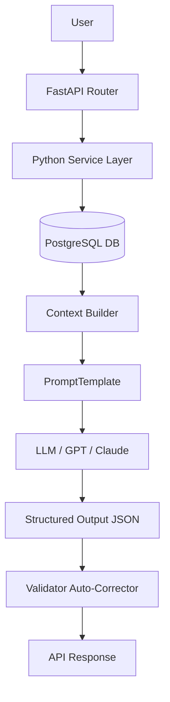

# DarkAtlas AI - Attack Surface Management

DarkAtlas is Buguard’s Attack Surface Monitoring (ASM) platform. It continuously discovers and tracks an organization’s internet-facing assets. The Asset Management module leverages advanced LangChain implementations to query, analyze, enrich, and report on cybersecurity risks.

**Status:** 🚀 Production-Ready (Passes all 26/26 tests, multi-tenant isolated, deterministically grounded, and Docker-ready).

## 1. Architecture Diagram


## 2. Technology Stack
- **API Framework**: FastAPI
- **Database**: PostgreSQL
- **ORM**: SQLAlchemy
- **AI Framework**: LangChain
- **Validation**: Pydantic

## 3. Folder Structure
```text
app/
├── routers/          # Thin API interfaces
├── services/         # Orchestration & Validation layers
├── chains/           # Pydantic schemas & LLM integrations
├── prompts/          # Few-shot Prompt templates
├── db/               # SQLAlchemy Models
├── utils/            # Evidence Extraction & Markdown Builder
└── main.py           # Application entrypoint
tests/                # Comprehensive mock-driven pytest suite
```

## 4. Database Schema
The database runs on PostgreSQL and tracks:
- **Assets**: `id`, `type`, `value`, `status`, `metadata_json`, `first_seen`, `last_seen`
- **Relationships**: `source_asset_id`, `target_asset_id`, `relationship_type`

## 5. API Endpoints
- `POST /import`: Idempotent data import with smart merge strategy.
- `POST /query`: Natural language queries returning strictly grounded inventory items.
- `POST /risk`: Contextual risk analysis summarizing EOL and Certificate threats.
- `POST /enrich`: AI enrichment wrapping predictions in a versioned `metadata.ai_enrichment.result` envelope.
- `GET /report/{tenant}`: Deterministic Markdown generation of the entire attack surface.

**Rate Limiting**: All endpoints are protected by `slowapi` with a global limit of `100 requests per minute`. Requests exceeding this will receive a `429 Too Many Requests` response.

### API Example: Querying
```json
// POST /query
{
  "tenant_id": "tenant_A",
  "question": "show expired certificates on production subdomains"
}
```

### API Example: Enrichment
```json
// POST /enrich
{
  "tenant_id": "tenant_A",
  "type": "technology",
  "value": "nginx"
}
```

## 6. LangChain Architecture
Why LangChain? We use LangChain heavily because it standardizes AI integration across the entire codebase:
- **PromptTemplate**: Separates Base Guardrail rules from Task-Specific rules.
- **Structured Output**: Forces the LLM to output rigid JSON rather than raw text, allowing programmatic validation.
- **Context Builder**: Scrubs ORM data, optimizing tokens and removing duplicates before the LLM sees it.
- **Validators**: The Python layer actively intercepts the LLM output and corrects hallucinated numbers.
- **Grounding**: Everything is traced strictly back to PostgreSQL facts.

## 7. Grounding Strategy
The LLM acts **exclusively as a parser and summarizer**. It never searches the database itself. 
Example (Report Chain): `DB Stats -> Python -> LLM Summarizes JSON -> Python Auto-Corrects JSON -> Python Generates Markdown`.

## 8. Guardrails
`base_system_prompt.py` is universally applied to every LLM call, prohibiting SQL generation, preventing answering off-topic questions, and enforcing explicit "unknown" fallback states.

## 9. Structured Outputs
Instead of Markdown, the LLM outputs exact Pydantic models (e.g. `QueryIntent`, `RiskAssessment`, `EnrichmentResult`, `ReportResult`).

## 10. Context Builder
A token-optimizing engine that removes all `None` values, empty arrays, and SQLAlchemy `_sa_instance_state` artifacts.

## 11. Running the Tests
The test suite utilizes a deterministic `MockLLM` to run quickly and reliably without requiring API Keys.
```bash
# Run all tests (API Coverage, Query Logic, Isolation, etc.)
pytest tests/
```

## 12. Setup and Run Instructions
To start the entire application (FastAPI web server + PostgreSQL database) with a single command, use Docker Compose:
```bash
docker-compose up --build
```
This will:
1. Spin up a PostgreSQL 15 database instance.
2. Build the FastAPI Python container.
3. Automatically apply SQLAlchemy database schemas on startup.

The application will be instantly available at `http://127.0.0.1:8000`.

## 13. Environment Variables
To run the project, ensure you have a `.env` file in the root directory (or inject these into Docker):
- `DATABASE_URL`: PostgreSQL connection string (e.g., `postgresql://postgres:postgres@db:5432/darkatlas`).
- `GOOGLE_API_KEY`: API Key for the Gemini LLM models (Required for AI features).
- `MODEL_NAME`: The LangChain model name (Default: `gemini-3.5-flash`).

## 14. API Documentation
Detailed API Documentation and interactive schemas are auto-generated by FastAPI. 
Once the app is running via Docker, navigate to:
- **Swagger UI**: [http://127.0.0.1:8000/docs](http://127.0.0.1:8000/docs)
- **ReDoc**: [http://127.0.0.1:8000/redoc](http://127.0.0.1:8000/redoc)

## 15. AI Track: Example Prompts and Outputs
Below are specific examples of how the LLM interprets natural language and translates it into deterministic system actions.

**Scenario A: Implicit Join & Environment Context**
- **User Prompt**: `"Show me databases on development subdomains"`
- **LLM Output (QueryIntent)**:
  ```json
  {
    "query_type": "VALID",
    "asset_type_filter": "technology",
    "keyword": "database",
    "requires_join": true,
    "relationship_type": "runs_on",
    "relationship_target": "subdomain",
    "target_environment": "development"
  }
  ```
- **System Action**: The backend converts this intent into a safe SQLAlchemy join, securely querying the DB.

**Scenario B: Lifecycle Expiration Filtering**
- **User Prompt**: `"Which certificates are expiring soon?"`
- **LLM Output (QueryIntent)**:
  ```json
  {
    "query_type": "VALID",
    "asset_type_filter": "certificate",
    "requires_expiring_soon_check": true
  }
  ```
- **System Action**: The backend filters the PostgreSQL `metadata_json->>'expires'` bounds against a dynamic 30-day UTC window.

## 16. Design Decisions and Assumptions
- **Assumption: Missing Metadata is Standard**: Attack surface discovery is messy. Certificates might be expired before they are even discovered by the scanner. Thus, we assume strict semantic validation constraints (like `first_seen < expires`) should be relaxed to allow real-world ingestion.
- **Decision: LLM Database Isolation**: The LLM is explicitly forbidden from generating SQL or directly communicating with the database. This eliminates Prompt Injection / SQL Injection vectors. It instead generates a rigid Pydantic `QueryIntent` which the Python backend safely converts to ORM queries.
- **Decision: Deterministic Markdown**: The LLM is notorious for hallucinating formatting. Markdown generation for the `/report` endpoint is handled by a deterministic Python script, while the LLM is only responsible for reading data and outputting a structured JSON summary.

## 17. What We Would Do Next (Future Improvements)
- **Semantic Vector Search**: Integrate a vector database (like pgvector) to embed asset metadata. This would allow fuzzy searching (e.g., `"Show me assets related to payment processing"`) which traditional SQL `ILIKE` keyword matching cannot natively handle.
- **Async Streaming for Reports**: When an organization has hundreds of thousands of assets, generating the markdown report could trigger HTTP timeouts. Implementing `StreamingResponse` alongside asynchronous Celery task queues would unblock the main event loop.
- **Granular RBAC**: Introduce Role-Based Access Control allowing specific users within a tenant to only view explicit subsets of data (e.g., an analyst can only see `development` assets).
